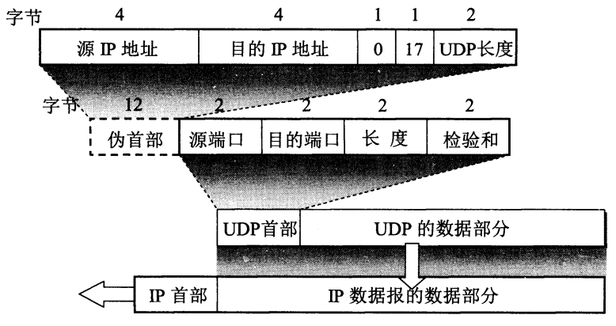
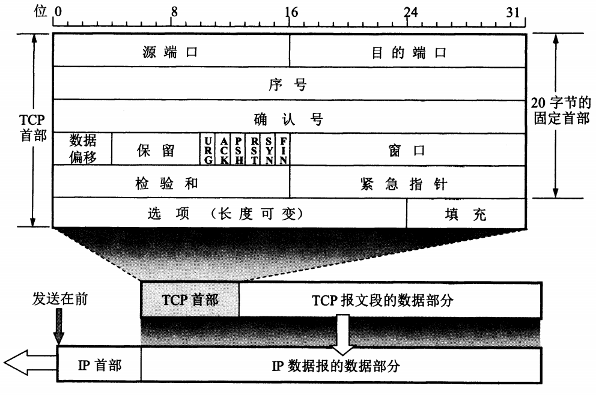
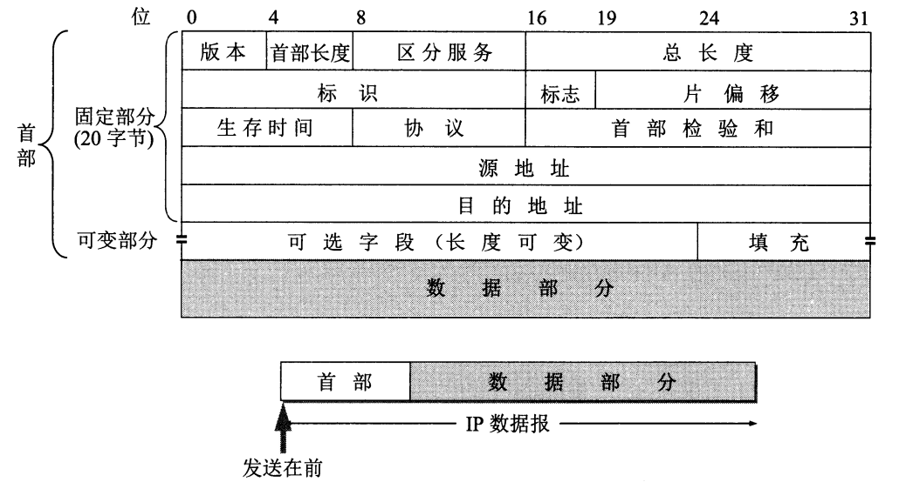
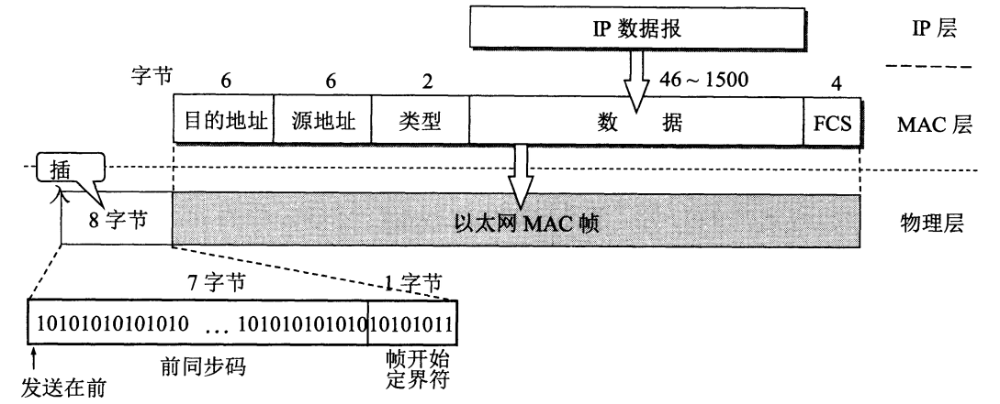

# 应用层
## 常用应用层协议
| 应用 | 应用层协议 | 运输层协议 |
| :--- | :--- | :---: |
| 名字转换 | DNS (域名系统) | [UDP](#udp) |
| 文件传送 | TFTP (简单文件传送协议) | [UDP](#udp) |
| 路由选择协议 | RIP (路由信息协议) | [UDP](#udp) |
| IP 地址配置 | DHCP (动态主机配置协议) | [UDP](#udp) |
| 网络管理 | SNMP (简单网络管理协议) | [UDP](#udp) |
| 远程文件服务器 | NFS (网络文件系统) | [UDP](#udp) |
| IP 电话 | 专用协议 | [UDP](#udp) |
| 流式多媒体通信 | 专用协议 | [UDP](#udp) |
| 多播 | IGMP (网际组管理协议) | [UDP](#udp) |
| 电子邮件 | SMTP (简单邮件传送协议) | [TCP](#tcp) |
| 远程终端接入 | TELNET (远程终端协议) | [TCP](#tcp) |
| 万维网 | HTTP (超文本传送协议) | [TCP](#tcp) |
| 文件传送 | FTP (文件传送协议) | [TCP](#tcp) |
## ftp
## sftp

## 熟知端口号
| **应用程序** | FTP | TELNET | SMTP | DNS | TFTP | HTTP | SNMP | SNMP(TRAP) | HTTPS |
|:---:|:---:|:---:|:---:|:---:|:---:|:---:|:---:|:---:|:---:|
| **熟知端口号** | 21 | 23 | 25 | 53 | 69 | 80 | 161 | 162 | 443 |

# 运输层(transport layer)

## 常用运输层协议
| 协议名 | ICMP | IGMP | IP | TCP | EGP | IGP | UDP | IPv6 | ESP | OSPF |
| :---: | :---: | :---: | :---: | :---: | :---: | :---: | :---: | :---: | :---: | :---: |
| **协议字段值** | 1 | 2 | 4 | 6 | 8 | 9 | 17 | 41 | 50 | 89 |

## UDP

### UDP首部
| Decimal | 2        | 2         | 2       | 2  |
|:---:|:---:|:---:|:---:|:---:|
| **Description** | [src_port](#熟知端口号) | [dest_port](#熟知端口号) | pkt_len | CS |

#### 伪首部
| **Decimal** | 4 | 4 | 1 | 1 | 2 |
|:---:|:---:|:---:|:---:|:---:|:---:|
| **Description** | Src_IPaddr | Dest_IPaddr | 0 | [Protocol_type](#常用运输层协议) | Pkt_len |
| **Value** | | | | 17 | |

## TCP

### TCP首部
| **Decimal** | 2 | 2 | 4 | 4 | 4b | 6b | 1b | 1b | 1b | 1b | 1b | 1b | 2 | 2 | 2 |
|:---:|:---:|:---:|:---:|:---:|:---:|:---:|:---:|:---:|:---:|:---:|:---:|:---:|:---:|:---:|:---:|
| **Description** | [src_port](#熟知端口号) | [dest_port](#熟知端口号) | [Seq](#seq) | Ack Seq | Pkt_len | Res | URG | ACK | PSH | RST | SYN | FIN | WINDOWS | CS | Urgent Pointer |

#### 伪首部
| **Decimal** | 4 | 4 | 1 | 1 | 2 |
|:---:|:---:|:---:|:---:|:---:|:---:|
| **Description** | Src_IPaddr | Dest_IPaddr | 0 | [Protocol_type](#常用运输层协议) | Pkt_len |
| **Value** | | | | 6 | |

### Seq
TCP报文中的字节流编号，指的是本报文段的第一个字节的序号

# 网络层(network layer)

## 常用网络层协议
| 协议名 | IP | Novell IPX |
| :---: | :---: | :---: |
| **协议字段值** | 0x0800 | 0x8137 |

## IP
### IP首部

| **Decimal** | [4b] | [4b] | 1 | 2 | 2 | [1b] | [1b] | [1b] | [13b] | 1 | 1 | 2 | 4 | 4 |
|:---:|:---:|:---:|:---:|:---:|:---:|:---:|:---:|:---:|:---:|:---:|:---:|:---:|:---:|:---:|
| **Description** | Version | Hdr_len | [TOS](#tos) | Pkt_len | ID | MF | DF | RES | Offset | TTL | [Protocol_type](#常用运输层协议) | CS(hdr) | Src_ip | Dest_ip |

#### TOS
type of service，可以作用COS？

# 数据链路层(data link layer)

## MAC
#### MAC帧格式

| **Decimal** | 6 | 6 | 2 | 46~1500 | 4 |
|:---:|:---:|:---:|:---:|:---:|:---:|
| **Description** | Src_MAC | Dest_MAC | [Protocol_type](#常用网络层协议) | [Packet](#mac-packet) | CRC |

#### MAC Packet
当数据字段的长度小于 46 字节时, MAC 子层就会在数据字段的后面加入一个整数字 节的填充字段, 以保证以太网的 MAC 帧长小于 64 字节。

# 物理层