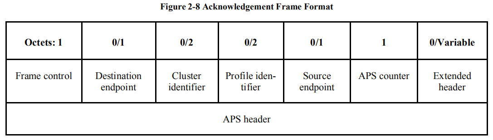

- [APS帧格式](#aps帧格式)
  - [Frame control](#frame-control)
    - [Frame Type](#frame-type)
    - [Delivery mode](#delivery-mode)
    - [Ack. format](#ack-format)
    - [Security](#security)
    - [Ack. Request](#ack-request)
    - [Extended Header Present](#extended-header-present)
  - [Destination endpoint](#destination-endpoint)
  - [Group Address](#group-address)
  - [Cluster Identifier](#cluster-identifier)
  - [Profile Identifier](#profile-identifier)
  - [Frame Payload](#frame-payload)
- [典型APS帧](#典型aps帧)
  - [Data Frame](#data-frame)
  - [Command Frame](#command-frame)
    - [**command identifier**](#command-identifier)
    - [Transport-Key](#transport-key)
      - [**Network Key**](#network-key)
      - [**Trust Center Link Key**](#trust-center-link-key)
    - [Request Key](#request-key)
    - [Verify Key](#verify-key)
    - [Confirm Key](#confirm-key)
  - [Acknowledgement Frame](#acknowledgement-frame)

<small><i><a href='http://ecotrust-canada.github.io/markdown-toc/'>Table of contents generated with markdown-toc</a></i></small>

## APS帧格式

| Octets  | 1                               | 0/1                                           | 0/2                             | 0/2                                       | 0/2                                       | 0/1             | 1           | 0/Variable      | Variable                        |
| ------- | ------------------------------- | --------------------------------------------- | ------------------------------- | ----------------------------------------- | ----------------------------------------- | --------------- | ----------- | --------------- | ------------------------------- |
| **Des** | [Frame Control](#frame-control) | [Destination endpoint](#destination-endpoint) | [Group Address](#group-address) | [Cluster Identifier](#cluster-identifier) | [Profile Identifier](#profile-identifier) | Source Endpoint | APS Counter | Extended Header | [Frame Payload](#frame-payload) |

### Frame control

| Bits    | 0-1                       | 2-3                             | 4                           | 5                     | 6                             | 7                                                   |
| ------- | ------------------------- | ------------------------------- | --------------------------- | --------------------- | ----------------------------- | --------------------------------------------------- |
| **Des** | [Frame Type](#frame-type) | [Delivery mode](#delivery-mode) | [Ack. format](#ack.-format) | [Security](#security) | [Ack. request](#ack.-request) | [Extented header present](#extended-header-present) |

#### Frame Type

| Value    | Frame Type Name                           |
| -------- | ----------------------------------------- |
| ***00*** | [Data](#data-frame)                       |
| ***01*** | [Command](#command-frame)                 |
| ***10*** | [Acknowledgement](#acknowledgement-frame) |
| ***11*** | Inter-PAN APS                             |

#### Delivery mode

#### Ack. format

| Value   | Description                       |
| ------- | --------------------------------- |
| ***0*** | APS data frame acknowledgement    |
| ***1*** | APS command frame acknowledgement |

#### Security

| Value   | Description |
| ------- | ----------- |
| ***0*** |             |
| ***1*** |             |

#### Ack. Request

| Value   | Description                                                  |
| ------- | ------------------------------------------------------------ |
| ***0*** | * the recipient shall not send an acknowledgement frame back to the originator.   * for all frames that are broadcast or multicast |
| ***1*** | the recipient shall construct and send an acknowledgement frame back to the originator |

#### Extended Header Present

| Value   | Description                                             |
| ------- | ------------------------------------------------------- |
| ***0*** | the extended header shall not be included in the frame. |
| ***1*** | the extended header shall be included in the frame.     |

### Destination endpoint

| Value (Octets: 0/1)                                          | Option                                         |
| ------------------------------------------------------------ | ---------------------------------------------- |
| ***NONE***                                                   | ***[Delivery mode](#delivery-mode) == 01/11*** |
| = ***0x00*** : All ZigBee device object (ZDO) = ***0x01~0xfe*** : specified Destination = ***0xff*** : all active endpoints (except endpoint 0x00) | ***[Delivery mode](#delivery-mode) == 00/10*** |

### Group Address 

| Value (Octets: 0/2) | Option                                            |
| ------------------- | ------------------------------------------------- |
| ***NONE***          | ***[Delivery mode](#delivery-mode) == 00/01/11*** |
| TODO                | ***[Delivery mode](#delivery-mode) == 11***       |

### Cluster Identifier 

| Val                   | Option                                                  |
| --------------------- | ------------------------------------------------------- |
| *[ZDP Cluster](#zdp)* | ***[Profile Identifier](#profile-identifier)==0x0000*** |
| *[ZCL Cluster](#zcl)* | ***[Profile Identifier](#profile-identifier)==others*** |

### Profile Identifier 

> This field shall be present only *[Frame Type](#frame-type)\==00/10*

| Val          | Des                 | Note        |
| ------------ | ------------------- | ----------- |
| ***0x0000*** | Device descriptions | [ZDP](#zdp) |
| ***others*** | Cluster identifiers | [ZCL](#zcl) |
| 0x0104       | HA                  |             |
| 0x0109       | SE                  |             |
| 0xA1E0       | GreenPower          |             |
| 0xC05E       | ZLL                 |             |
| 0xFFFF       | Wildcard            |             |

### Frame Payload 

## 典型APS帧

### Data Frame

* **Frame Control**

| Bits    | 0-1                       | 2-3                             | 4                           | 5                     | 6                             | 7                                                   |
| ------- | ------------------------- | ------------------------------- | --------------------------- | --------------------- | ----------------------------- | --------------------------------------------------- |
| **Des** | [Frame Type](#frame-type) | [Delivery mode](#delivery-mode) | [Ack. format](#ack.-format) | [Security](#security) | [Ack. request](#ack.-request) | [Extented header present](#extended-header-present) |
| **Val** | ***00***                  |                                 |                             |                       |                               |                                                     |

### Command Frame

> 参考Zigbee specification -> 4.4 APS Layer Security

| Octets  | 1                                                   | 1           | 1                                                            | variable            |
| ------- | --------------------------------------------------- | ----------- | ------------------------------------------------------------ | ------------------- |
| **val** | ***[Frame Control](#command-frame-frame-control)*** | APS counter | [***APS command identifier***](#command-frame-command-identifier) | APS command payload |

* **Frame Control**

  | Bits    | 0-1                       | 2-3                             | 4                           | 5                     | 6                             | 7                                                   |
  | ------- | ------------------------- | ------------------------------- | --------------------------- | --------------------- | ----------------------------- | --------------------------------------------------- |
  | **Des** | [Frame Type](#frame-type) | [Delivery mode](#delivery-mode) | [Ack. format](#ack.-format) | [Security](#security) | [Ack. request](#ack.-request) | [Extented header present](#extended-header-present) |
  | **Val** | ***01***                  | ***00/10***                     | ***0***                     | ***0/1***             | ***0***                       | ***1***                                             |

#### **command identifier**

>跳转过去都为APS command payload部分

| Value           | Conmend Identifier                                |
| --------------- | ------------------------------------------------- |
| ***0x01~0x04*** | Reserved                                          |
| ***0x05***      | [APS_CMD_TRANSPORT_KEY](#transport-key)           |
| ***0x06***      | APS_CMD_UPDATE_DEVICE                             |
| ***0x07***      | APS_CMD_REMOVE_DEVICE                             |
| ***0x08***      | [APS_CMD_REQUEST_KEY](#command-frame-request-key) |
| ***0x09***      | APS_CMD_SWITCH_KEY                                |
| ***0x0A~0x0D*** | Reserved                                          |
| ***0x0E***      | APS_CMD_TUNNEL                                    |
| ***0x0F***      | [APS_CMD_VERIFY_KEY](#command-frame-verify-key)   |
| ***0x10***      | [APS_CMD_CONFIRM_KEY](#command-frame-confirm-key) |

#### Transport-Key

| Octets    | 1                                                   | variable                                                     |
| --------- | --------------------------------------------------- | ------------------------------------------------------------ |
| **Value** | [***StandardKeyType***](#standardkeytype-parameter) | ***Key descriptor*** (取决于StandardKeyType的值，分为以下几种情况) |

##### [**Network Key**](#standard-network-key-standard-network-key)

| Octets  | 16          | 1               | 8                                                            | 8                                                            |
| ------- | ----------- | --------------- | ------------------------------------------------------------ | ------------------------------------------------------------ |
| **Des** | key         | Sequence number | Destination address                                          | Source address                                               |
| **Val** | network key |                 | = ***all-zero string*** :  network key is sent to a broadcast address = ***Extended Destination*** | =  ***0xFFFFFFFFFFFFFFFF*** :  distributed security network with no Trust Center = ***Extended Source*** |

##### [**Trust Center Link Key**](#standard-network-key-trust-center-link-key)

#### Request Key

| Octets: 1 | Key Type                                                     |
| --------- | ------------------------------------------------------------ |
| **Value** | ***0x00-0x01*** :  Reserved ***0x02*** : Application Link Key ***0x03*** : Reserved ***0x04*** : Trust Center Link Key ***0x05-0xff*** : Reserved |

#### Verify Key

| Octets    | 1                                                   | 8              | 16                              |
| --------- | --------------------------------------------------- | -------------- | ------------------------------- |
| **Value** | [***StandardKeyType***](#standardkeytype-parameter) | Source address | Initiator Verify-Key Hash Value |

#### Confirm Key

| Octets    | 1                              | 1                                                   | 8                   |
| --------- | ------------------------------ | --------------------------------------------------- | ------------------- |
| **Value** | ***[Status](#status-values)*** | [***StandardKeyType***](#standardkeytype-parameter) | Destination address |

###  Acknowledgement Frame

| Octets    | 1                                 | 0/1                                                          | 0/2                                                          | 0/2                                                          | 0/1                                                          | 1                                                           | 0/Variable        |
| --------- | --------------------------------- | ------------------------------------------------------------ | ------------------------------------------------------------ | ------------------------------------------------------------ | ------------------------------------------------------------ | ----------------------------------------------------------- | ----------------- |
| **Name**  | *[Frame Control](#frame-control)* | *[Destination endpoint](#destination-endpoint)*              | *[Cluster Identifier](#cluster-identifier)*                  | *[Profile Identifier](#profile-identifier)*                  | *Source Endpoint*                                            | *APS Counter*                                               | *Extended Header* |
| **Value** |                                   | = ***NONE*** : [Frame Control-Ack. format](#ack.-format)***==1*** = [***default value***](#acknowledgement-frame-default-value) : otherwise | = ***NONE*** : [Frame Control-Ack. format](#ack.-format)***==1*** = [***default value***](#acknowledgement-frame-default-value) : otherwise | = ***NONE*** : [Frame Control-Ack. format](#ack.-format)***==1*** = [***default value***](#acknowledgement-frame-default-value) : otherwise | = ***NONE*** : [Frame Control-Ack. format](#ack.-format)***==1*** = [***default value***](#acknowledgement-frame-default-value) : otherwise | [***default value***](#acknowledgement-frame-default-value) |                   |

 default value : the same values as in the frame to which this frame is an acknowledgement.

NOTE : 和要相应的APS帧的对应位保持一致