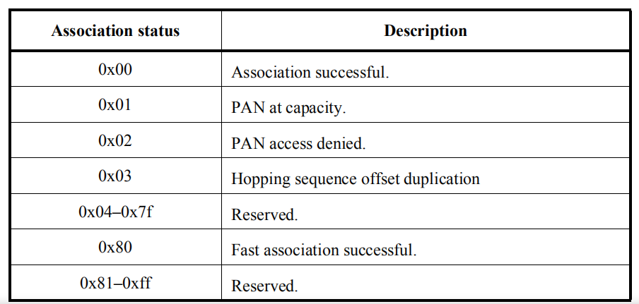
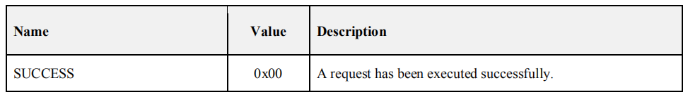
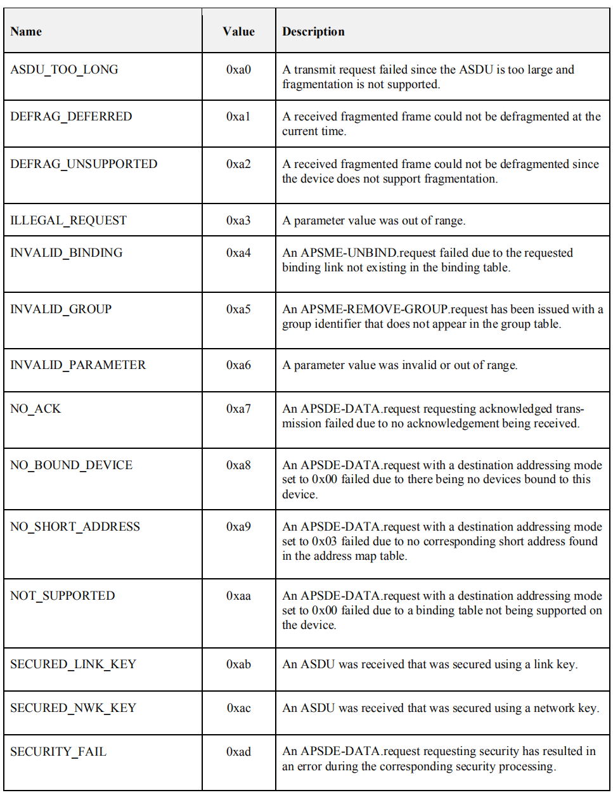
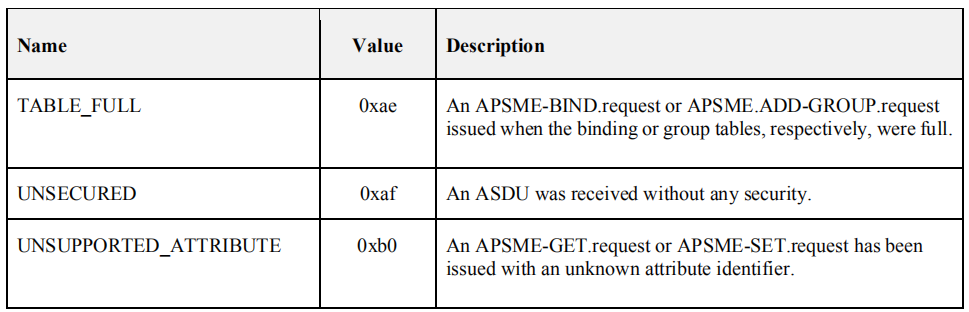

- [MAC](#mac)
  * [MAC Constans](#mac-constans)
  * [MIB](#mib)
- [NWK](#nwk)
  * [NWK Constans](#nwk-constans)
  * [NIB](#nib)
- [APS](#aps)
- [Enums](#enums)
  * [Association Status](#association-status)
  * [StandardKeyType](#standardkeytype)
  * [Broadcast Addresses](#broadcast-addresses)
  * [APS Status Values](#aps-status-values)

<small><i><a href='http://ecotrust-canada.github.io/markdown-toc/'>Table of contents generated with markdown-toc</a></i></small>

## MAC

> 参考[802.15.4-2015](https://gitlab.espressif.cn:6688/thread_zigbee/ieee802154_docs/-/blob/master/ieee802154/802.15.4-2015.pdf) -> 8.4 MAC constants and PIB attributes

### MAC Constans

### MIB

| flag               | description                                                  |
| ------------------ | ------------------------------------------------------------ |
| &diams; | attribute is optional for an RFD                             |
| &clubs; | attribute is read-only  (i.e.,attribute can only be set by the MAC sublayer) |

| Attribute                                    | Type         | Range                    | Description                                                  | Default                            |
| -------------------------------------------- | ------------ | ------------------------ | ------------------------------------------------------------ | ---------------------------------- |
| ***macAssociationPermit***&diams; | Boolean      | ***TRUE/FALSE***         | Indication of whether a coordinator is currently allowing association. A value of TRUE indicates that association is permitted | FALSE                              |
| ***macBsn***&diams;               | Integer      | *0x00–0xff*              | The sequence number added to the transmitted beacon frame.   | Random value from within the range |
| ***macCoordExtendedAddress***                | IEEE address | An extended IEEE address | The address of the coordinator through which the device is associated |                                    |
| ***macDsn***                                 | Integer      | *0x00–0xff*              | The sequence number added to the transmitted Data frame or MAC command. | Random value from within the range |
| ***macCoordShortAddress***                   | Integer      | *0x0000–0xffff*          | The short address assigned to the coordinator through which the device is associated. A value of 0xfffe indicates that the coordinator is only using its extended address. A value of *0xffff* indicates that this value is unknown. |                                    |
| ***macExtendedAddress***&clubs;   | IEEE address | Device specific          | The extended address assigned to the device.                 |                                    |
| ***macPanId***                               | Integer      | *0x0000–0xffff*          | The identifier of the PAN on which the device is operating. If this value is 0xffff, the device is not associated | *0xffff*                           |
| ***macRxOnWhenIdle***                        | Boolean      | TRUE, FALSE              | Indication of whether the MAC sublayer is to enable its receiver during idle periods. For a beacon-enabled PAN, this attribute is relevant only during the CAP of the incoming superframe. For a nonbeacon-enabled PAN, this attribute is relevant at all times | FALSE                              |
| ***macShortAddress***                        | Integer      | *0x0000–0xffff*          | The address that the device uses to communicate in the PAN. If the device is the PAN coordinator, this value shall be chosen before a PAN is started. Otherwise, the short address is allocated by a coordinator during association | *0xffff*                           |

## NWK

### NWK Constans

| Constant                       | Description                                                  | Value                           |
| ------------------------------ | ------------------------------------------------------------ | ------------------------------- |
| ***nwkcCoordinatorCapable***   | A Boolean flag indicating whether the device is capable of becoming the ZigBee coordinator. A value of 0x00 indicates that the device is not capable of becoming a coordinator while a value of 0x01 indicates that the device is capable of becoming a coordinator. | Configuration dependent         |
| ***nwkcDefaultSecurityLevel*** | The default security level to be used (see Chapter 4).       | Defined in stack profile        |
| ***nwkcMinHeaderOverhead***    | The minimum number of octets added by the NWK layer to an NSDU. | 0x08                            |
| ***nwkcProtocolVersion***      | The version of the ZigBee NWK protocol in the device.        | ***0x02***                      |
| ***nwkcWaitBeforeValidation*** | The number of OctetDurations, on the originator of a multicast route request, between receiving a route reply and sending a message to validate the route. | 0x9c40 (0x500 msec on 2.4 GHz)  |
| ***nwkcRouteDiscoveryTime***   | The number of OctetDurations until a route discovery expires. | 0x4c4b4(0x2710 msec on 2.4 GHz) |

### NIB

| Attribute                  | Id   | Type    | Read Only | Range         | Description                                                  | Default |
| -------------------------- | ---- | ------- | --------- | ------------- | ------------------------------------------------------------ | ------- |
| nwkTimeStamp               | 0x8C | Boolean | No        | TRUE or FALSE | A flag that determines if a time stamp indication is provided on incoming and outgoing packets. TRUE= time indication provided. FALSE = no time indication provided. | FALSE   |
| ***nwkParentInformation*** | 0xAB | Bitmask | No        | 0x00-0xFF     | The behavior depends upon whether the device is an FFD or RFD. For an RFD, this records the information received in an End Device Timeout Response command indicating the parent information. The bitmask values are defined in Table 3-55. For an FFD, this records |         |

## APS

## Enums

### Association Status

### StandardKeyType

(Transport-Key, Verify-Key, Confirm-Key)

| Enumeration                                                  | Value      | Description                                                  |
| ------------------------------------------------------------ | ---------- | ------------------------------------------------------------ |
| Reserved                                                     | ***0x00*** | Reserved                                                     |
| Standard network key | ***0x01*** | Indicates that the key is a network key to be used in standard security mode |
| Reserved                                                     | ***0x02*** | Reserved                                                     |
| Application link key | ***0x03*** | Indicates the key is a link key used as a basis of security between two devices. |
| Trust-Center link key | ***0x04*** | Indicates that the key is a link key used as a basis for security between the Trust Center and another device. |
| Reserved                                                     | ***0x05*** | Reserved                                                     |

### Broadcast Addresses

|  Broadcast Address  | Destination Group                                     |
| :-----------------: | ----------------------------------------------------- |
|    ***0xffff***     | All devices in PAN                                    |
|    ***0xfffe***     | Reserved                                              |
|    ***0xfffd***     | [***macRxOnWhenIdle***](#macrxonwhenidle) == **TRUE** |
|    ***0xfffc***     | All routers and coordinator                           |
|    ***0xfffb***     | Low power routers only                                |
| ***0xfff8-0xfffa*** | Reserved                                              |

### APS Status Values

