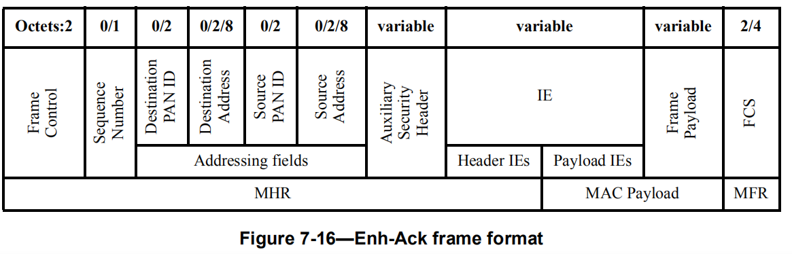

- [MAC帧格式](#mac帧格式)
  - [Frame Control](#frame-control)
    - [Frame Type](#frame-type)
    - [Security Enabled](#security-enabled)
    - [Frame Pending](#frame-pending)
    - [AR](#ar)
    - [PAN ID Compression](#pan-id-compression)
    - [Sequence Number Suppression](#sequence-number-suppression)
    - [IE Present](#ie-present)
    - [Destination/Source Addressing Mode](#destinationsource-addressing-mode)
    - [Frame Version](#frame-version)
  - [Destination PAN ID](#destination-pan-id)
  - [Destination Address](#destination-address)
  - [IEs](#ies)
    - [Header IEs](#header-ies)
      - [Element ID](#element-id)
        - [DA IE](#da-ie)
    - [Payload IEs](#payload-ies)
- [典型MAC帧](#典型mac帧)
  - [Beacon](#beacon)
    - [常规Beacon](#常规beacon)
    - [Enhanced Beacon](#enhanced-beacon)
  - [Data](#data)
  - [Ack](#ack)
    - [Imm-Ack](#imm-ack)
    - [Enh-Ack](#enh-ack)
  - [MAC Command](#mac-command)
    - [Association Request](#association-request)
    - [Association Response](#association-response)
    - [Data Request](#data-request)
      - [type1](#type1)
      - [type2](#type2)
      - [type3](#type3)
    - [Beacon Request](#beacon-request)

<small><i><a href='http://ecotrust-canada.github.io/markdown-toc/'>Table of contents generated with markdown-toc</a></i></small>

> 参考[802.15.4-2015](https://gitlab.espressif.cn:6688/thread_zigbee/ieee802154_docs/-/blob/master/ieee802154/802.15.4-2015.pdf)

## MAC帧格式


| Octets  | 1/2                             | 0/1             | 0/2                                       | 0/2/8                                       | 0/2           | 0/2/8          | variable                  | variable                  | variable                    | variable      | 2/4  |
| ------- | ------------------------------- | --------------- | ----------------------------------------- | ------------------------------------------- | ------------- | -------------- | ------------------------- | ------------------------- | --------------------------- | ------------- | ---- |
| **Des** | [Frame Control](#frame-control) | Sequence Number | [Destination PAN ID](#destination-pan-id) | [Destination Address](#destination-address) | Source PAN ID | Source Address | Auxiliary Security Header | [Header IEs](#header-ies) | [Payload IEs](#payload-ies) | Frame Payload | FCS  |

### Frame Control

| Bits:0-2                  | 3                                     | 4                               | 5         | 6                                         | 7        | 8                                                           | 9                         | 10-11                                                        | 12-13                           | 14-15                                                        |
| ------------------------- | ------------------------------------- | ------------------------------- | --------- | ----------------------------------------- | -------- | ----------------------------------------------------------- | ------------------------- | ------------------------------------------------------------ | ------------------------------- | ------------------------------------------------------------ |
| [Frame Type](#frame-type) | [Security Enabled](#security-enabled) | [Frame Pending](#frame-pending) | [AR](#ar) | [PAN ID Compression](#pan-id-compression) | Reserved | [Sequence Number Suppression](#sequence-number-suppression) | [IE Present](#ie-present) | [Destination Addressing Mode](#destinationsource-addressing-mode) | [Frame Version](#frame-version) | [Source Addressing Mode](#destinationsource-addressing-mode) |

#### Frame Type

| Value     | Description      |
| --------- | ---------------- |
| ***000*** | Beacon           |
| ***001*** | Data             |
| ***010*** | Acknowledgment   |
| ***011*** | MAC Command      |
| ***100*** | Reserved         |
| ***101*** | Multipurpose     |
| ***110*** | Fragment of Frak |
| ***111*** | Extended         |

#### Security Enabled

| value   | description                                                  |
| ------- | ------------------------------------------------------------ |
| ***1*** | the frame is protected by the MAC sublayer<br />(The Auxiliary Security Header field of the MHR shall be present ) |
| ***0*** | otherwise                                                    |

#### Frame Pending

| value   | description                                                  |
| ------- | ------------------------------------------------------------ |
| ***1*** | the device sending the frame has more data for the recipient, as described in 6.7.3. |
| ***0*** | otherwise                                                    |

```
The Frame Pending field shall be used only in Beacon frames or frames transmitted either during the CAP by devices operating on a beacon-enabled PAN or at any time by devices operating on a nonbeacon-enabled PAN.
```

#### AR

| value   | description                                  |
| ------- | -------------------------------------------- |
| ***1*** | the recipient device shall send an Ack frame |
| ***0*** | otherwise                                    |

#### PAN ID Compression

> Frame Version==0b00/0b01

* either the destination or the source addressing information is present

| value   | description                                                  |
| ------- | ------------------------------------------------------------ |
| ***0*** | the PAN ID field of the single address shall be included in the transmitted frame |

* both destination and the source addressing information is present

| value   | description                                                  |
| ------- | ------------------------------------------------------------ |
| ***0*** | the destination and source PAN identifiers are different (both Destination PAN ID field and Source PAN ID fields shall be included in the transmitted frame) |
| ***1*** | the destination and source PAN identifiers are identical (the Source PAN ID field shall be omitted from the transmitted frame) |

> Frame Version==0b10


#### Sequence Number Suppression

| value   | condition                                              | description                                                  |
| ------- | ------------------------------------------------------ | ------------------------------------------------------------ |
| ***0*** | * Frame Version field == ***0b00/0b01***<br />* others | the Sequence Number field is present                         |
| ***1*** |                                                        | the Sequence Number field in the frame is suppressed, and the sequence number shall be omitted |

#### IE Present

#### Destination/Source Addressing Mode


#### Frame Version


### Destination PAN ID

| Value                             | Option                                                       |
| --------------------------------- | ------------------------------------------------------------ |
| ***NONE***                        | [Destination Addressing Mode](#destinationsource-addressing-mode) == ***00*** |
| *unique PAN ID*                   | [Destination Addressing Mode](#destinationsource-addressing-mode) == ***10/11*** |
| ***0xffff*** (broadcast address ) | [Destination Addressing Mode](#destinationsource-addressing-mode) == ***10/11*** |

### Destination Address

| Value                                                   | Option                                                       |
| ------------------------------------------------------- | ------------------------------------------------------------ |
| ***NONE***                                              | [Destination Addressing Mode](#destinationsource-addressing-mode) == ***00*** |
| ***short address***                                     | [Destination Addressing Mode](#destinationsource-addressing-mode) == ***10*** |
| ***extended address***                                  | [Destination Addressing Mode](#destinationsource-addressing-mode) == ***11*** |
| ***0xffff/0xffff ffff ffff ffff*** (broadcast address ) | [Destination Addressing Mode](#destinationsource-addressing-mode) == ***10/11*** |

### IEs


<font color=red>Header IEs属于Header，不需要加密。Payload IEs属于payload，可能需要加密。</font>

#### Header IEs

|                    Bits: 0 - 6                     |          7 - 14           |   15    | Octets: 0 - 127 |
| :------------------------------------------------: | :-----------------------: | :-----: | :-------------: |
| Length (the number of octets in the Content field) | [Element ID](#element-id) | Type =0 |     Content     |

##### Element ID

<font color=red>&radic; -  the IE may be used in that frame. If there is not an &radic;  in the column, then the IE shall not be used in that frame</font>

<font color=red>UL -  the layers above the MAC.</font>

| Element ID | Name                                  | Enhanced Beacon | Enhanced ACK | Data | Multipurpose | MAC command | Used by | Created by |
| ---------- | ------------------------------------- | --------------- | ------------ | ---- | ------------ | ----------- | ------- | ---------- |
| ***0x2b*** | [DA IE](#da-ie) (Device Announcement) | &radic;         |              |      |              |             | UL      | UL         |

###### DA IE

| Bits     | 0                                                            | 1                                                            | 2-5        | 6-15                                                         | 16-20                                                        | 21-23                                                        | variable                                 |
| -------- | ------------------------------------------------------------ | ------------------------------------------------------------ | ---------- | ------------------------------------------------------------ | ------------------------------------------------------------ | ------------------------------------------------------------ | ---------------------------------------- |
| **Name** | *Address Mode*                                               | *Addresses Pending*                                          | *Reserved* | *Number of Addresses*                                        | *Sequence Number*                                            | *Page Number*                                                | *Address List*                           |
| **Val**  | = ***0*** : each address included in Address List is a short address<br />= ***1*** :  each address included in Address List is an extended address | = ***0*** :  the set of addresses to be announced is contained in a single DA IE.<br />= ***1*** :the set of neighbor addresses is to be announced in multiple Beacon frames ( indicates that this IE contains a subset of the set of neighbor addresses known by the device and more neighbor addresses are to be sent in following Beacon frames with a DA IE) |            | the number of neighbor addresses included in the Address List field of this DA IE | = ***0*** : Addresses Pending== ***0***<br /> = ***x*** (the set of addresses to be announced) | = ***0*** : Addresses Pending== ***0***<br />= ***1*** : for the first subset of address<br />= ***++*** : for each subsequent subset of addresses | the addresses of the device’s neighbors. |


#### Payload IEs


## 典型MAC帧

### Beacon

#### 常规Beacon

> *<font color=red>Frame Version=0b00/0b01</font>*


#### Enhanced Beacon

> *<font color=red>Frame Version=0b10</font>*


### Data


### Ack

#### Imm-Ack

> *<font color=red>Frame Version=0b00/0b01</font>*


#### Enh-Ack

> *<font color=red>Frame Version=0b10</font>*



### MAC Command


> 跳转部分均为`Content`部分及一些特殊field取值

| Command ID      | Command name                                                 | RFD-TX  | RFD-RX  |
| --------------- | ------------------------------------------------------------ | ------- | ------- |
| ***0x01***      | [Association Request command](#association-request)          | &radic; |         |
| ***0x02***      | [Association Response command](#association-response-command) |         | &radic; |
| ***0x03***      | Disassociation Notification command                          | &radic; | &radic; |
| ***0x04***      | [Data Request command](#data-request)                        | &radic; |         |
| ***0x05***      | PAN ID Conflict Notification command                         | &radic; |         |
| ***0x06***      | Orphan Notification command                                  | &radic; |         |
| ***0x07***      | [Beacon Request command](#beacon-request)                    |         |         |
| ***0x08***      | Coordinator realignment command                              |         | &radic; |
| ***0x09***      | GTS request command                                          |         |         |
| ***0x0a***      | TRLE Management Request command                              |         |         |
| ***0x0b***      | TRLE Management Response command                             |         |         |
| ***0x0c–0x12*** | Reserved                                                     |         |         |
| ***0x13***      | DSME Association Request command                             |         |         |
| ***0x14***      | DSME Association Response command                            |         |         |

#### Association Request

> <font color=red>All devices, except for RFD-RX and RFD-TX devices, shall be capable of transmitting this command</font>

| Bits      | 0          | 1                                                           | 2                                                            | 3                                                            | 4                                                            | 5          | 6                                                            | 7                                                            |
| --------- | ---------- | ----------------------------------------------------------- | ------------------------------------------------------------ | ------------------------------------------------------------ | ------------------------------------------------------------ | ---------- | ------------------------------------------------------------ | ------------------------------------------------------------ |
| **Name**  | *Reserved* | *Device Type*                                               | *Power Source*                                               | *Receiver On When Idle*                                      | *Association Type*                                           | *Reserved* | *Security Capability*                                        | *Allocate Address*                                           |
| **Value** | ***0***    | ***1*** : device is an FFD<br />***0*** :  device is an RFD | ***1*** : the device is receiving power from the alternating current mains.(由交流电供电)<br />***0*** : otherwise | ***1*** :  the device does not disable its receiver to conserve power during idle periods(设备空闲期间不关闭接收)<br />***0*** : otherwise | ***1*** :  device requests fast association<br />***0*** : otherwise | ***0***    | ***1*** : device is capable of sending and receiving cryptographically protected MAC frames<br />***0*** : otherwise | ***1*** : device wishes the coordinator to allocate a short address<br />***0*** : otherwise |

#### Association Response

> <font color=red>This command shall only be sent by the PAN coordinator or coordinator to a device that is currently trying
> to associate.All devices, except for RFD-RX and RFD-TX devices, shall be capable of receiving this command.</font>

| Octets  | 2                                                            | 1                                               |
| ------- | ------------------------------------------------------------ | ----------------------------------------------- |
| **des** | Short Address                                                | Association Status                              |
| **val** | = ***0xffff*** : coordinator was not able to associate the device to its PAN<br />= ***0xfffe*** :  device has been successfully associated with a PAN but has not been allocated a short address. In this case, the device shall communicate on the PAN using only its extended address<br />= ***others*** :  device may use in its communications on the PAN until it is disassociated. | [***Association Status***](#association-status) |

#### Data Request

> <font color=red>All devices, except for RFD-TX devices, shall be capable of transmitting this command</font>
>
> Content = ***NONE***
>
> > type1 [response to the receipt of a Beacon frame](#type1)
> >
> > type2 [triggered by the reception of an MLME-POLL.request primitive](#type2)
> >
> > type3 [following the acknowledgment to an Association Request command](#type3)

##### type1

[Frame Control-Destination PAN ID](#destination-pan-id) = ***0xffff*** (broadcast PAN ID)

[Frame Control-Destination Address](#destination-address) = ***0xffff*** (broadcast short ID)

##### type2


##### type3

[Frame Control-Destination PAN ID](#destination-pan-id) =  [***macPanId***](Attributes#MIB)

[Frame Control-Destination Address](#destination-address)= 

* ***[macCoordExtendedAddress](Attributes#MIB)*** : Destination Addressing Mode=11

* [***macCoordShortAddress***](Attributes#MIB) : Destination Addressing Mode=10

[Frame Control-Source Address](#source-address) = [***macExtendedAddress***](Attributes#MIB)

#### Beacon Request

> <font color=red>This command is optional for an RFD.</font>
>
> Content = ***NONE***

[Frame Control-Destination PAN ID](#destination-pan-id) = ***0xffff*** (broadcast PAN ID)

[Frame Control-Destination Address](#destination-address) = ***0xffff*** (broadcast short ID)

