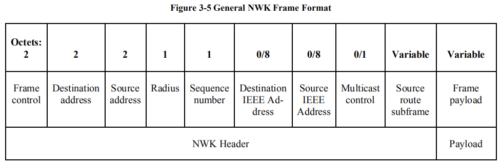
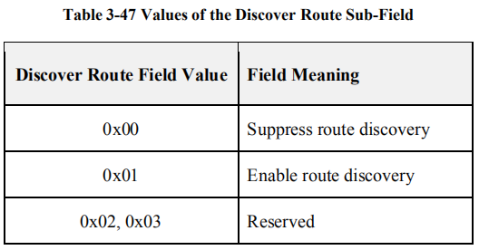
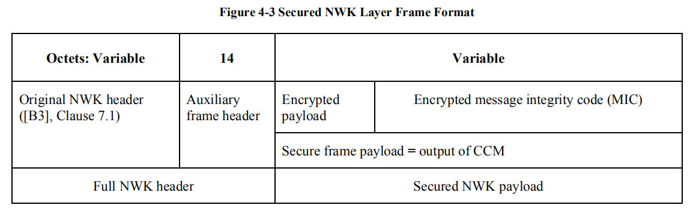
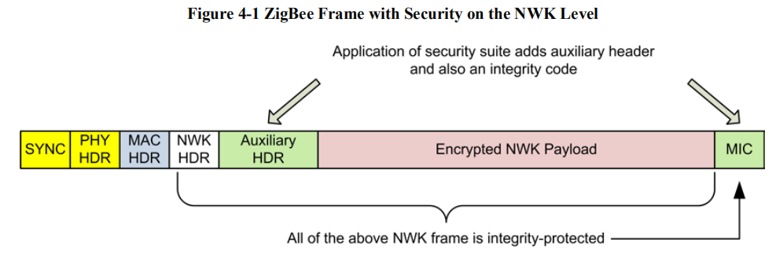
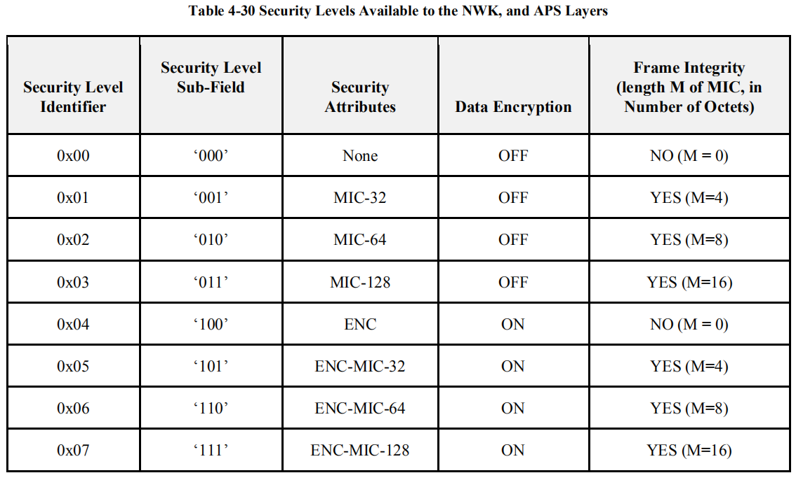
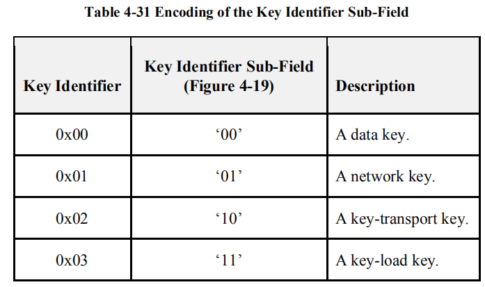

- [NWK帧格式](#nwk帧格式)
  - [Frame Control](#frame-control)
    - [Frame Type](#frame-type)
    - [Protocol version](#protocol-version)
    - [Discover route](#discover-route)
    - [Multicast flag](#multicast-flag)
    - [Security](#security)
    - [Source Route](#source-route)
    - [Destination IEEE Address](#destination-ieee-address)
    - [Source IEEE Address](#source-ieee-address)
    - [End Device Initiator](#end-device-initiator)
  - [Destination Address](#destination-address)
  - [Source Address](#source-address)
  - [Radius](#radius)
  - [Sequence Number](#sequence-number)
  - [Destination IEEE Address](#destination-ieee-address-1)
  - [Source IEEE Address](#source-ieee-address-1)
  - [Multicast Control](#multicast-control)
- [典型NWK帧](#典型nwk帧)
  - [Data Frame](#data-frame)
  - [NWK Command Frame](#nwk-command-frame)
    - [NWK command identifier](#nwk-command-identifier)
    - [Link Status](#link-status)
      - [MAC Data Service Requirements](#mac-data-service-requirements)
      - [NWK Header Fields](#nwk-header-fields)
      - [NWK Payload Fields](#nwk-payload-fields)
  - [Secured NPDU Frame](#secured-npdu-frame)
    - [Auxiliary Frame Header (Security Header)](#auxiliary-frame-header-security-header)
      - [Security Control](#security-control)
        - [Security level](#security-level)
        - [Key identifier](#key-identifier)
        - [Extended nonce](#extended-nonce)
      - [Auxiliary HDR Source address](#auxiliary-hdr-source-address)
      - [Key sequence number](#key-sequence-number)

<small><i><a href='http://ecotrust-canada.github.io/markdown-toc/'>Table of contents generated with markdown-toc</a></i></small>

> 参考[zigbee specification R22](https://gitlab.espressif.cn:6688/thread_zigbee/ieee802154_docs/-/blob/master/zigbee/zigbee-specification-R22.pdf) -> chapter 3 Network Specification

## NWK帧格式

| Octets  | 2                               | 2                                           | 2                                 | 1                 | 1                                   | 0/8                                                   | 0/8                                         | 0/1                                     | Variable              | Variable      |
| ------- | ------------------------------- | ------------------------------------------- | --------------------------------- | ----------------- | ----------------------------------- | ----------------------------------------------------- | ------------------------------------------- | --------------------------------------- | --------------------- | ------------- |
| **Des** | [Frame Control](#frame-control) | [Destination Address](#destination-address) | [Source Address](#source-address) | [Radius](#radius) | [Sequence number](#sequence-number) | [Destination IEEE Address](#destination-ieee-address) | [Source IEEE Address](#source-ieee-address) | [Multicast Control](#multicast-control) | Source Route Subframe | Frame Payload |

### Frame Control

| Bits    |           0 - 1           |                 2 - 5                 |               6 - 7               |                  8                  |            9            |        10        |                        1 1                       |                      12                      |                13                | 14 - 15|
| ------- | :-----------------------: | :-----------------------------------: | :-------------------------------: | :---------------------------------------------: | :---------------------------------: | :---------------------------: | :----------------------------------------------------------: | :-------------------------------------------------------: | :-------------------------------------------: | :------------------: |
| **Des** | [Frame type](#frame-type) | [Protocol version](#protocol-version) | [Discover route](#discover-route) | [Multicast flag](#multicast-flag) | [Security](#security) | [Source Route](#source-route) | [Destination IEEE Address](#destination-ieee-address) | [Source IEEE Address](#source-ieee-address) | [End Device Initiator](#end-device-initiator) |       Reserved       |

#### Frame Type

| Value    | Frame Type Name               |
| -------- | ----------------------------- |
| ***00*** | [Data](#data-frame)           |
| ***01*** | [NWK Command](#nwk-command-frame)|
| ***10*** | Reserved                      |
| ***11*** | Inter-PAN                     |

#### Protocol version

= [***nwkcProtocolVersion***](#nwkcprotocolversion)

#### Discover route

For NWK layer command frames, the discover route sub-field shall be set to 0x00 indicating suppression of route 
discovery.

#### Multicast flag

| Value   | Option            |
| ------- | ----------------- |
| ***0*** | unicast/broadcast |
| ***1*** | multicast         |

#### Security

| Value   | Option                                                       |
| ------- | ------------------------------------------------------------ |
| ***0*** | security for this frame is implemented at another layer or disabled entirely |
| ***1*** | the frame is to have NWK security operations enabled         |

when Security==***1***,  the frame is to have NWK security operations enabled, NWK frame refers to [Secured NPDU Frame](#secured-npdu-frame).

#### Source Route

| Value   | Description                                        |
| ------- | -------------------------------------------------- |
| ***0*** | source route subframe is present in the NWK header |
| ***1*** | source route subframe is not present               |

#### Destination IEEE Address

| Value   | Description                                                  |
| ------- | ------------------------------------------------------------ |
| ***0*** | Broadcast/Multicast/others                                   |
| ***1*** | Unicast && the NWK header is to include the full IEEE address of the destination. |

#### Source IEEE Address

| Value   | Description                                                  |
| ------- | ------------------------------------------------------------ |
| ***0*** | otherwise                                                    |
| ***1*** | the NWK header is to include the full IEEE address of the source device |

#### End Device Initiator

| Value | Description                                                  |
| ----- | ------------------------------------------------------------ |
| 0     | otherwise                                                    |
| 1     | the source of the message is an end device and [***nwkParentInformation***](#nwkparentinformation) &ne; ***0*** |

### Destination Address

| Value(Octets: 2)                                             | Option                                                       |
| ------------------------------------------------------------ | ------------------------------------------------------------ |
| [***macShortAddress***](#macshortaddress) (destination device) / [***Broadcast Addresses***](#broadcast-addresses) | [***Multicast flag***](#frame-control-multicast-flag) == ***0*** |
| Group ID of the destination multicast group                  | [***Multicast flag***](#frame-control-multicast-flag) == ***1*** |

###  Source Address

= [***macShortAddress***](#macshortaddress)

###   Radius

 specifies the range of a radius-limited transmission. The field shall be decremented by 1 by each receiving device.

***Note*** : 网络层最大传输节点数

###   Sequence Number

shall be incremented by 1 with each new frame transmitted.

###  Destination IEEE Address

| Value(Octets: 0/8)                                           | Option                                                       |
| ------------------------------------------------------------ | ------------------------------------------------------------ |
| [***macExtendedAddress***](#macextendedaddress) (destination device) | otherwise                                                    |
| ***NONE***                                                   | [***Destination Address***](#destination-address) == broadcast/multicast address |

### Source IEEE Address

### Multicast Control

| Value(Octets: 0/1)                                          | Option                                  |
| ----------------------------------------------------------- | --------------------------------------- |
| ***NONE***                                                  | ***[Multicast flag](#allowable) == 0*** |
| ***[Multicast Control Format](#multicast-control-format)*** | ***[Multicast flag](#allowable) == 1*** |

* **Multicast Control Format**

| Bits    | 0-1            | 2-4             | 5-7                |
| ------- | -------------- | --------------- | ------------------ |
| **Des** | Multicast mode | NonmemberRadius | MaxNonmemberRadius |

TODO

## 典型NWK帧

### Data Frame

| Octets: 2                       | Variable       | Variable     |
| ------------------------------- | -------------- | ------------ |
| [Frame control](#frame-control) | Routing fields | Data payload |

> 注意：当[NWK Frame Control-Security](#frame-control-security)使能后，Data Frame会转化为[Secured NPDU Frame](#secured-npdu-frame)模式，此时上图中的NWK payload (  Data payload)会被加密后放入Secured NPDU Frame-Encrypted payload位置

### NWK Command Frame

| Octets: 2                       | Variable       | 1                                                           | Variable            |
| ------------------------------- | -------------- | ----------------------------------------------------------- | ------------------- |
| [Frame Control](#frame-control) | Routing fields | [NWK command identifier](#command-frame-command-identifier) | NWK command payload |

> 注意：当[NWK Frame Control-Security](#frame-control-security)使能后，Command Frame会转化为[Secured NPDU Frame](#secured-npdu-frame)模式，此时上表中的NWK payload (Command identifier + Command payload)会被加密后放入Secured NPDU Frame-Encrypted payload位置

#### NWK command identifier

> 跳转内容均为NWK command payload。

| Value            | Conmend Name                              |
| ---------------- | ----------------------------------------- |
| ***0x01***       | Route request                             |
| ***0x02***       | Route reply                               |
| ***0x03***       | Network Status                            |
| ***0x04***       | Leave                                     |
| ***0x05***       | Route Record                              |
| ***0x06***       | Rejoin request                            |
| ***0x07***       | Rejoin response                           |
| ***0x08***       | [Link Status](#command-frame-link-status) |
| ***0x09***       | Network Report                            |
| ***0x0A***       | Network Update                            |
| ***0x0B***       | End Device Timeout Request                |
| ***0x0C***       | End Device Timeout Response               |
| ***0x0D***       | Link Power Delta                          |
| ***0x0E～0xFF*** | Reserved                                  |

#### Link Status

#####  MAC Data Service Requirements

##### NWK Header Fields

##### NWK Payload Fields

* **format**

  | Octets: 1                                                    | Variable                                                     |
  | ------------------------------------------------------------ | ------------------------------------------------------------ |
  | [Command options](#link-status-payload-fields-command-options) | [Link status list](#link-status-payload-fields-link-status-list) |

  * **Command options**

    | Bit             | 0-4                                                          | 5                                                            | 6                                                            | 7        |
    | --------------- | ------------------------------------------------------------ | ------------------------------------------------------------ | ------------------------------------------------------------ | -------- |
    | **Name**        | Entry count                                                  | First frame                                                  | Last frame                                                   | Reserved |
    | **Description** | the number of link status entries present in the link status list |                                                              |                                                              |          |
    | **Value**       |                                                              | ***1*** : this is the first frame of the sender's link status **or** the sender's link status fits into a single frame  | ***1*** : this is the last frame of the sender's link status **or** the sender's link status fits into a single frame  |          |

  * **Link status list**

    | Octets   | 2                        | 1                                                            |
    | -------- | ------------------------ | ------------------------------------------------------------ |
    | **Name** | Neighbor network address | [Link status](#link-status-payload-fields-link-status-list-link-status) |

    * **Link status**

      | Bits            | 0-2                                                     | 3        | 4-6                                                          | 7        |
      | --------------- | ------------------------------------------------------- | -------- | ------------------------------------------------------------ | -------- |
      | **Name**        | Incoming cost                                           | Reserved | Outgoing cost                                                | Reserved |
      | **Description** | the device's estimate of the link cost for the neighbor |          | the value of the outgoing cost field from the neighbor table. |          |
      | **Value**       | ***1~7***                                               |          |                                                              |          |

### Secured NPDU Frame

在NWK的原始帧的Frame Payload中划分出一部分作为Auxiliary
frame header和MIC，不进行加密。剩下的部分加密传输

| Octets: Variable              | 14                                                           | Variable          | Variable                               |
| ----------------------------- | ------------------------------------------------------------ | ----------------- | -------------------------------------- |
| [Original NWK header](#frame) | [Auxiliary Frame Header](#secured-npdu-frame-auxiliary-frame-header) | Encrypted payload | Encrypted message integrity code (MIC) |

####  Auxiliary Frame Header (Security Header)

| Octets: 1                                                    | 4             | 0/8                                             | 0/1                                         |
| ------------------------------------------------------------ | ------------- | ----------------------------------------------- | ------------------------------------------- |
| [Security Control](#secured-npdu-frame-auxiliary-frame-header-security-control) | Frame counter | [Source address](#auxiliary-hdr-source-address) | [Key sequence number](#key-sequence-number) |

##### Security Control

| Bit: 0-2                          | 3-4                               | 5                                 | 6-7      |
| --------------------------------- | --------------------------------- | --------------------------------- | -------- |
| [Security level](#security-level) | [Key identifier](#key-identifier) | [Extended nonce](#extended-nonce) | Reserved |

###### Security level

###### Key identifier

###### Extended nonce

| Value   | Option                                                  |
| ------- | ------------------------------------------------------- |
| ***1*** | sender address field of the auxiliary header is present |
| ***0*** | otherwise                                               |

##### Auxiliary HDR Source address

| Value                                                        | Option                                                       |
| ------------------------------------------------------------ | ------------------------------------------------------------ |
| ***NONE***                                                   | [Extended nonce](#secured-npdu-frame-auxiliary-frame-header-security-control-extended-nonce) == ***0*** |
| extended 64-bit address of the device responsible for securing the frame | [Extended nonce](#secured-npdu-frame-auxiliary-frame-header-security-control-extended-nonce) == ***1*** |

##### Key sequence number

| Value (Octets: 0/1)                                          | Option                                                       |
| ------------------------------------------------------------ | ------------------------------------------------------------ |
| the key sequence number of the network key used to secure the frame. | [Key identifier](#secured-npdu-frame-auxiliary-frame-header-security-control-key-identifier) == ***01*** |
| ***NONE***                                                   | otherwise                                                    |

