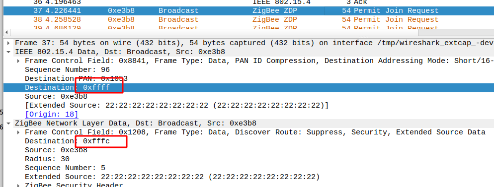
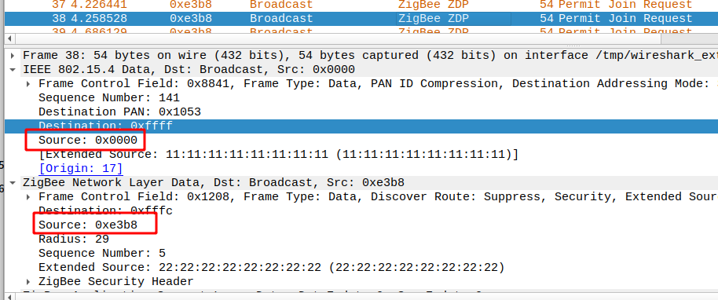

- [ ] coordinator发送Transport Key-Network Key不需要remote device先进行Request Key?发送Transport Key-Trust Center Link Key需要remote device先进行Request Key?

- [ ] [Permit Join Request](#ZDP Client Services-Network Management-Mgmt_Permit_Joining_req)发送过程，是否控制和哪个节点组网？为啥Coordinator不发送？

- [ ] MAC的source adress和NWK的source adress为啥不一样？

- [ ] 转发在什么情况下会出现？

- [ ] Coordinator PAN ID设置没有作用？