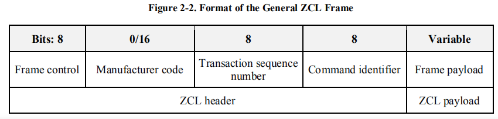

- [Cluster List](APS#cluster-identifier)
- [ZCL帧格式](#zcl帧格式)
  * [Frame control](#frame-control)
    + [Frame type](#frame-type)
    + [Manufacturer specific](#manufacturer-specific)
    + [Direction](#direction)
    + [Disable Default Response](#disable-default-response)
  * [Manufacturer code](#manufacturer-code)
  * [Transaction sequence number](#transaction-sequence-number)
  * [Command identifier](#command-identifier)
    + [通用Command](#--command)
    + [特定Command](#--command)
  * [Frame payload](#frame-payload)
- [典型Cluster](#典型cluster)
  * [On/Off](#on-off)
    + [Command](#command)
      - [Off with effect Payload](#off-with-effect-payload)
      - [On with timed off Payload](#on-with-timed-off-payload)
    + [Behavior](#behavior)
    + [Attribute](#attribute)
    + [Dependency](#dependency)
  * [Level Control](#level-control)
    + [Command](#command-1)
      - [Move to Leve Payload](#move-to-leve-payload)
      - [Move](#move)
      - [Step](#step)

<small><i><a href='http://ecotrust-canada.github.io/markdown-toc/'>Table of contents generated with markdown-toc</a></i></small>

>参考[Zigbee Cluster Library specification](https://gitlab.espressif.cn:6688/thread_zigbee/ieee802154_docs/-/blob/master/zigbee/zigbee-cluster-library-R8.pdf)

> ZCL frames are transmitted via the APS sub-layer by issuing the APSDE-DATA.request primitive.
>
> NOTE: ZCL是[APS Data Frame](APS#data-frame)的Payload部分，根据[APS Cluster Identifier](APS#cluster-identifier)来制定具体的cluster。需要注意：每个设备可以理解为多个cluster的集合（list），而zcl 约定了这里cluster，同时对于每一个固定cluser又是同时包含一个或者多个**A**ttribute、**B**ehavior、**C**ommand、**D**ependency

## [Cluster List](APS#cluster-identifier)

| ID           | Cluster Name                                    | Description                                                  |
| ------------ | ----------------------------------------------- | ------------------------------------------------------------ |
| ***0x0000*** | Basic                                           | Attributes for determining basic information about a device, setting user device information such as description of location, and enabling a device. |
| ***0x0001*** | Power Configuration                             | Attributes for determining more detailed information about a device's power source(s), and for configuring under/over voltage alarms. |
| ***0x0002*** | Device Temperature configuration                | Attributes for determining information about a device's internal temperature, and for configuring under/over temperature alarms. |
| ***0x0003*** | Identify                                        | Attributes and commands for putting a device into Identification mode (e.g., flashing a light) |
| ***0x0004*** | Groups                                          | Attributes and commands for allocating a device to one or more of a number of groups of devices, where each group is addressable by a group address. |
| ***0x0005*** | Scenes                                          | Attributes and commands for setting up and recalling a number of scenes for a device. Each scene corresponds to a set of stored values of specified device attributes. |
| ***0x0006*** | [On/Off](#zcl-典型cluster-on/off)               | Attributes and commands for switching devices between 'On' and 'Off' states. |
| ***0x0007*** | On/Off Switch Configuration                     | Attributes and commands for configuring on/off switching devices |
| ***0x0008*** | [Level Control](#zcl-典型cluster-level-control) | Attributes and commands for controlling a characteristic of devices that can be set to a level between fully 'On' and fully 'Off'. |

## ZCL帧格式

| Bits    | 8                                   | 0/16                                        | 8                                                            | 8                                             | Variable                            |
| ------- | ----------------------------------- | ------------------------------------------- | ------------------------------------------------------------ | --------------------------------------------- | ----------------------------------- |
| **Des** | [Frame Control](#zcl-frame-control) | [Manufacturer code](#zcl-manufacturer-code) | [Transaction sequence number](#zcl-transaction-sequence-number) | [Command identifier](#command-identifier) | [Frame payload](#zcl-frame-payload) |

### Frame control

| Bits:   0-1                                 | 2                                                            | 3                                         | 4                                                            | 5-7      |
| ------------------------------------------- | ------------------------------------------------------------ | ----------------------------------------- | ------------------------------------------------------------ | -------- |
| [Frame type](#zcl-frame-control-frame-type) | [Manufacturer specific](#zcl-frame-control-manufacturer-specific) | [Direction](#zcl-frame-control-direction) | [Disable Default Response](#zcl-frame-control-disable-default-response) | Reserved |

#### Frame type

| Value       | Description                                                  |
| ----------- | ------------------------------------------------------------ |
| ***00***    | Command is global for all clusters, including manufacturer specific clusters |
| ***01***    | Command is specific or local to a cluster                    |
| ***10/11*** | Reserved                                                     |

#### Manufacturer specific

| Value   | Description                                                  |
| ------- | ------------------------------------------------------------ |
| ***1*** | the [manufacturer code](#zcl-frame-control-manufacturer-specific) field SHALL be present in the ZCL frame. |
| ***0*** | the [manufacturer code](#zcl-frame-control-manufacturer-specific) field SHALL not be included in the ZCL frame |

#### Direction

| Value   | Description                                                  |
| ------- | ------------------------------------------------------------ |
| ***1*** | the command is being sent from the server side of a cluster to the client side of a cluster |
| ***0*** | the command is being sent from the client side of a cluster to the server side of a cluster. |

#### Disable Default Response

| Value   | Description                                                  | Option                                                       |
| ------- | ------------------------------------------------------------ | ------------------------------------------------------------ |
| ***1*** | the Default Response command will only be returned if there is an error | response frames generated as the immediate and direct effect of a previously received frame. ==MYQ(IR?)== |
| ***0*** | the Default Response command will be returned                |                                                              |

### Manufacturer code

### Transaction sequence number

### Command identifier

#### 通用Command

当[Frame type](#zcl-frame-control-frame-type) == ***00***，对于任意Cluster下面的Attribute，zcl约定一系列的通用操作命令。

| Command Identifier Field Value | Description                           |
| ------------------------------ | ------------------------------------- |
| ***0x00***                     | Read Attributes                       |
| ***0x01***                     | Read Attributes Response              |
| ***0x02***                     | Write Attributes                      |
| ***0x03***                     | Write Attributes Undivided            |
| ***0x04***                     | Write Attributes Response             |
| ***0x05***                     | Write Attributes No Response          |
| ***0x06***                     | Configure Reporting                   |
| ***0x07***                     | Configure Reporting Response          |
| ***0x08***                     | Read Reporting Configuration          |
| ***0x09***                     | Read Reporting Configuration Response |
| ***0x0a***                     | Report attributes                     |
| ***0x0b***                     | Default Response                      |
| ***0x0c***                     | Discover Attributes                   |
| ***0x0d***                     | Discover Attributes Response          |

#### 特定Command

当[Frame type](#zcl-frame-control-frame-type) == 01，针对特定类型的[cluster](#zcl-cluster-list)，有不同的[Command](#典型cluster)。

### Frame payload

ZCL Frame payload存在与否视具体[ZCL Cluster](#zcl-cluster-list)和[ZCL Command identifier](#zcl-command-identifier)而定。

## 典型Cluster

### On/Off

#### Command

| [Command Identifier](#zcl-command-identifier) | Description                 | M//O | [Payload](#zcl-frame-payload)                                |
| --------------------------------------------- | --------------------------- | ---- | ------------------------------------------------------------ |
| ***0x00***                                    | Off                         | M    | NONE                                                         |
| ***0x01***                                    | On                          | M    | NONE                                                         |
| ***0x02***                                    | Toggle                      | M    | NONE                                                         |
| ***0x40***                                    | Off with effect             | O    | [Off with effect Payload](#zcl-典型cluster-on/off-command-off-with-effect-payload) |
| ***0x41***                                    | On with recall global scene | O    | NONE                                                         |
| ***0x42***                                    | On with timed off           | O    | [On with timed off Payload](#zcl-典型cluster-on/off-command-on-with-timed-off-on-with-timed-off-payload) |

##### Off with effect Payload

##### On with timed off Payload

| Octets          | 1                                                            | 2                                                            | 2                                                            |
| --------------- | ------------------------------------------------------------ | ------------------------------------------------------------ | ------------------------------------------------------------ |
| **Data Type**   | uint8                                                        | uint 16                                                      | uint16                                                       |
| **Field Name**  | On/off Control                                               | On Time                                                      | Off Wait Time                                                |
| **Value**       | [***On/off Control***](#zcl-典型cluster-on/off-command-on-with-timed-off-payload-on/off-control) | ***0x0000 ~ 0xfffe***                                        | ***0x0000 ~ 0xfffe***                                        |
| **Description** | contains information on how the device is to be operated.    | the length of time (in 1/10ths second) that the device is to remain “on” | the length of time (in 1/10ths second) that the device SHALL remain “off” |

* **On/off Control**

  | Bits      | 0                                                            | 1-7      |
  | --------- | ------------------------------------------------------------ | -------- |
  | **Name**  | Accept Only When On                                          | Reserved |
  | **Value** | ***1*** :  the On With Timed Off command SHALL only be accepted if the [OnOff](#zcl-典型cluster-on/off-attribute-onoff) attribute is equal to 0x01 ***0*** :  the On With Timed Off command SHALL be processed unconditionally |          |

#### Behavior

#### Attribute

| Identifier   | Name                                                         | Type   | Range                 | Access                     | Default | M/O  | Value                           |
| ------------ | ------------------------------------------------------------ | ------ | --------------------- | -------------------------- | ------- | ---- | ------------------------------- |
| ***0x0000*** | OnOff | bool   | 0x00-0x01             | Read Only Reportable Scene | 0x00    | M    | ***0*** : Off ***1*** : On |
| ***0x4000*** | GlobalSceneControl                                           | bool   | 0x00-0x01             | Read Only                  | 0x01    | O    |                                 |
| ***0x4001*** | OnTime                                                       | uint16 | ***0x0000 ~ 0xffff*** | Read Write                 | 0x0000  | O    |                                 |
| ***0x4002*** | OffWaitTime                                                  | uint16 | ***0x0000 ~ 0xffff*** | Read Write                 | 0x0000  | O    |                                 |

#### Dependency

### Level Control

#### Command

| [Command Identifier](#zcl-command-identifier) | Description                 | M//O | [Payload](#zcl-frame-payload)                                |
| --------------------------------------------- | --------------------------- | ---- | ------------------------------------------------------------ |
| ***0x00***                                    | Move to Level               | M    | [Move to Level Payload](#zcl-典型cluster-level-control-command-move-to-leve-payload) |
| ***0x01***                                    | Move                        | M    | [Move Payload](#zcl-典型cluster-level-control-command-move-payload) |
| ***0x02***                                    | Step                        | M    | [Step Payload](#zcl-典型cluster-level-control-command-step-payload) |
| ***0x03***                                    | Stop                        | M    |                                                              |
| ***0x04***                                    | Move to Level (with On/Off) | M    |                                                              |
| ***0x05***                                    | Move (with On/Off)          | M    |                                                              |
| ***0x06***                                    | Step (with On/Off)          | M    |                                                              |
| ***0x07***                                    | Stop                        | M    |                                                              |

##### Move to Leve Payload

##### Move

##### Step

| Octets          | 1                                      | 1                                                           | 2                                                            |
| --------------- | -------------------------------------- | ----------------------------------------------------------- | ------------------------------------------------------------ |
| **Data Type**   | enum8                                  | uint8                                                       | uint16                                                       |
| **Field Name**  | *Step mode*                            | *Step size*                                                 | *Transition time*                                            |
| **Value**       | ***0x00*** : Up ***0x01*** : Down |                                                             | ***0xffff*** :  the device SHOULD move as fast as it is able ***0x0001 ~ 0xffff*** : others |
| **Description** |                                        | A step is a change in the CurrentLevel of 'Step size' units | the time that SHALL be taken to perform the step(in 1/10ths second) |

